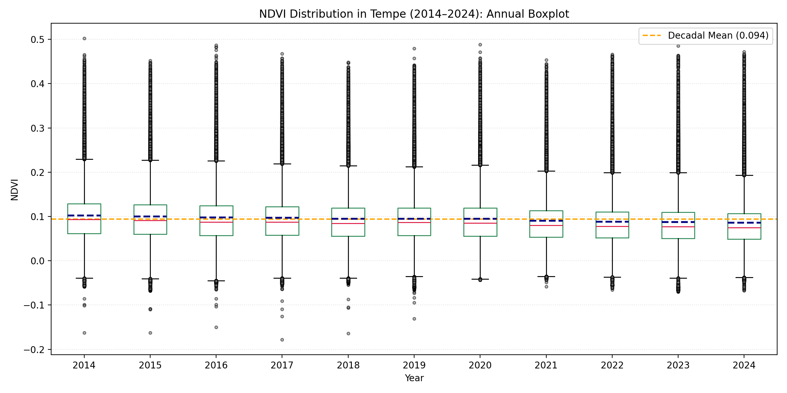
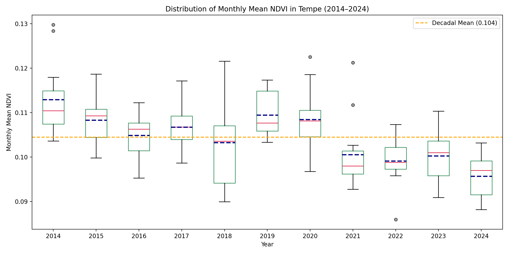
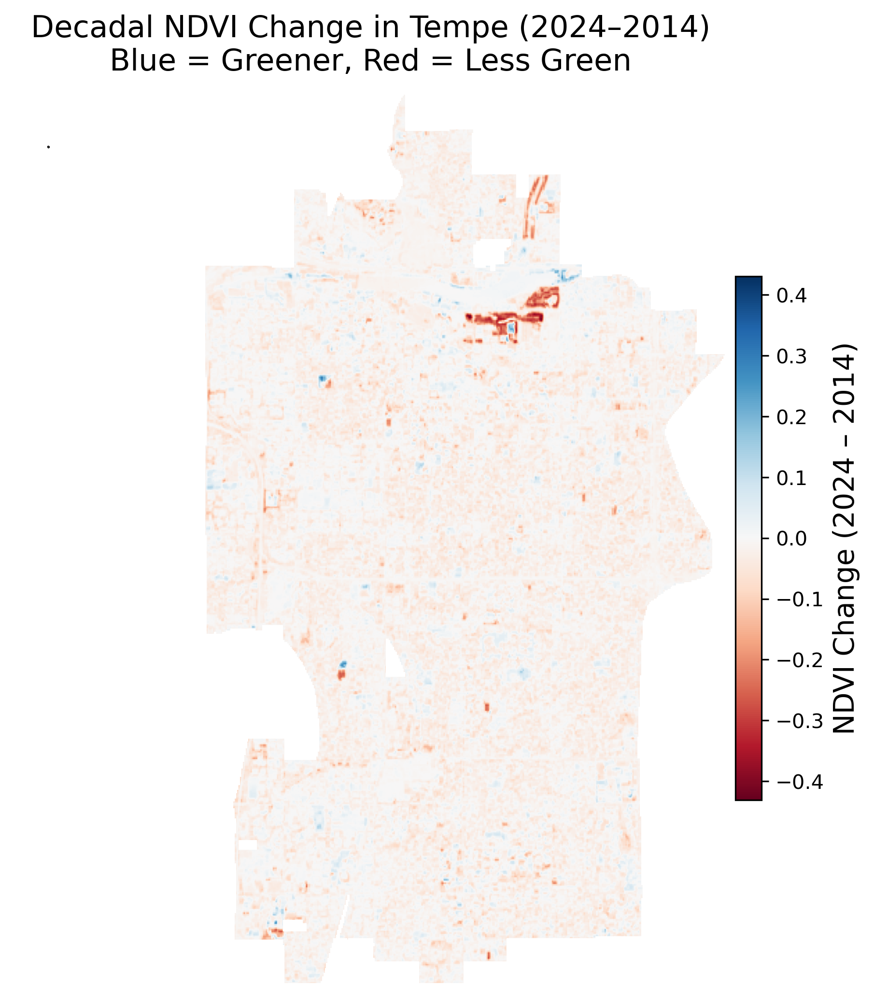

# Khayrun Nahar [Mitu](https://namedrop.io/khayrunnahar)

Hello! I am a first year doctoral student at [Arizona State University](https://www.asu.edu/). I am a Civil Engineer interested in Hydrology, Climate Change, and Sustainability.

Here are ways you can contact me:
* [Email](mailto:sustnitu@gmail.com)
* LinkedIN
* Github

  
## ESIIL Data Short Course

### Exercise 1: Embedding a Location Map Using OpenStreetMap
  In this exercise, I embedded a map showing the location of my current workplace. The map was created using OpenStreetMap and highlights the specific area of my work location in Tempe, Arizona.

### Map of Arizona State University
<embed type="text/html" src="/img/asu.html" width="400" height="400">

### Exercise 2: Visualizing Annual Average Temperature in Karachi, Pakistan
  In this exercise, I created a plot showing the annual trend of average temperature in Karachi, Pakistan. This visualization helps illustrate long-term temperature patterns in the region and supports climate-related insights.

### Annual Average Temperature in Karachi, Pakistan
<embed type="text/html" src="/img/annual_climate_plot.html" width="400" height="250">

### Exercise 3: Visualizing Tubarjal NDVI Differences
  I learned to load geospatial raster data with code and overlay it with vector boundaries.I then computed statistical summaries (mean) of raster values to evaluate vegetation health 2013-2025 vs 2001-2012 under groundwater irrigation.

### Spatial Change of NDVI
<embed type="text/html" src="/img/Tuburjal_NDVI_Difference" width="400" height="400">

### Assignment and Reflection
I learned how to analyze spatial and time-series data and document my work using GitHub and Markdown. I practiced working with satellite imagery . This  helped me understand the steps involved in open and reproducible science.

### Decadal Change in Urban Greenery in Tempe, AZ (2014–2024)
  In this assignment, I applied skills in spatial data analysis, mapping, and open science to examine changes in urban greenery in Tempe, Arizona from 2014 to 2024.
  I analyzed satellite (Landsat ) imagery, processed time-series and spatial data, and documented my workflow using GitHub and Markdown.  
  
### Tempe Greenery Patterns ((2014–2024)
  Following figure  presents yearly NDVI maps for Tempe from 2014 to 2024. Across all years, greener areas (higher NDVI) are mainly found in city parks and irrigated 
  zones, while the rest of  the city maintains moderate to low NDVI values. The general spatial distribution of greenery remains similar year after year.
  
  The boxplot of annual NDVI shows that NDVI values in Tempe remained fairly consistent from 2014 to 2024. Each year’s distribution is similar, and the decadal 
  mean (0.094) is marked with a dashed orange line. There are only small variations from year to year.
  
  Again from the monthly NDVI distribution of each year, the boxplot shows that median NDVI values were above the decadal mean (0.104) in the earlier years,
  but dropped below the mean in the later years. Each year includes 12 monthly data points. This indicates a gradual decrease in monthly NDVI over the decade, 
  reflecting a slight overall decline in urban greenery in Tempe from 2014 to 2024.
  
  The monthly mean NDVI for each year as line plots shows All years follow a similar seasonal pattern, with higher NDVI in the spring and early summer,
  and lower values  in winter. The overall height of the lines in recent years is a bit lower compared to the start of the decade.
  <embed type="text/html" src="/img/monthly_ndvi_trends_year.html" width="400" height="400">
  
### Decadal Change
  From the decadal change map, most of Tempe displays light red shades, indicating a slight decrease in NDVI over the decade. Only small areas appear blue,
  reflecting modest increases in vegetation. These changes are subtle and spread throughout the city.
  

### Assignment Workflow
  
### 1. Data Collection
  Obtain monthly NDVI raster data (e.g., from Google Earth Engine) for each year from 2014 to 2024. Acquire the Tempe city boundary shapefile for spatial masking.
  
### 2. Preprocessing
  * Clip all NDVI rasters to the Tempe boundary to focus analysis on the area of interest.
  * Check raster alignment to ensure all datasets are on the same grid and projection.
  * Mask and remove pixels outside the Tempe boundary.
 
### 3. Annual and Monthly Aggregation
  * For each year, calculate the annual mean NDVI by averaging monthly NDVI rasters.
  * For trend analysis, extract mean NDVI values for each month and year.
  
### 4. Visualization
  * Create annual NDVI maps (Figure 1) to visualize spatial patterns of greenery for each year.
  * Plot monthly NDVI trends for each year as line graphs (Figure 4) to observe seasonal variations.
  * Summarize annual NDVI distributions with boxplots for all years (Figure 3).
 
### 5. Decadal Change Calculation
  * Compute pixel-wise NDVI difference: Subtract the 2014 annual mean NDVI raster from the 2024 annual mean NDVI raster.
  * Visualize decadal NDVI change as a color-coded map (Figure 2), with blue showing gains and red showing losses in vegetation.

